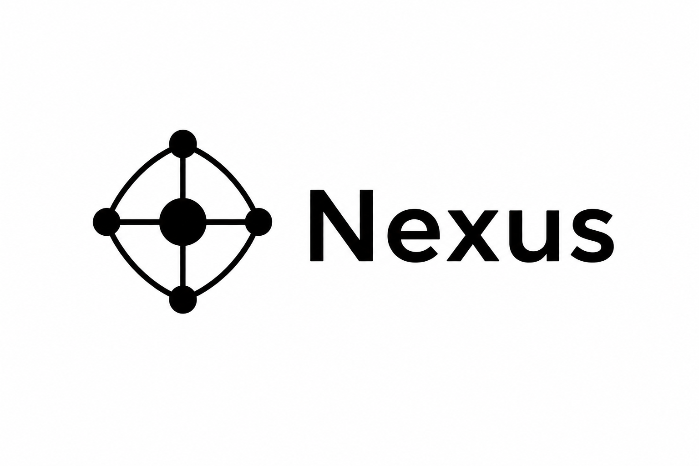

# Nexus



A lightweight WhatsApp bot built on Baileys, designed to run efficiently even on low-end servers. Nexus handles sticker creation, media downloads from various platforms, AI chatbot features, group management tools, and a collection of everyday utilities, all through regular WhatsApp chats. No dashboard, no subscriptions.

## Features

- **Media Download & Conversion**: Download content from YouTube, TikTok, Instagram, Twitter/X, Facebook, Pinterest, Spotify, and several other platforms, then instantly send it back as a media file.
- **Sticker & Media Makers**: Convert images and videos into static or animated stickers, add sticker watermarks, and generate meme images or fake comment screenshots for entertainment.
- **AI Chatbot**: Powered by Google Gemini, with persistent conversation history for each user.
- **Group Management**: Basic moderation, welcome messages, anti-spam protection, and various admin tools.
- **Lightweight Economy System**: Daily limits, energy, rewards, and a simple user-to-user payment system.

The complete list of available commands can be accessed anytime by sending the `menu` command after the bot is connected.

## Requirements

| Requirement | Version |
|---|---|
| Node.js | ≥ 20.18.1 (24.x LTS recommended) |
| Yarn | 1.22.x |
| FFmpeg | 6.x |
| RAM | Minimum 512 MB, 1 GB or more recommended |

Nexus is built directly on the [`@itsliaaa/baileys`](https://github.com/itsliaaa/baileys) fork.

If you replace it with another Baileys fork, compatibility and any issues that arise become your own responsibility.

## Installation

```bash
git clone https://github.com/huokaaa/nexus.git
cd nexus
yarn install
```

After installing the dependencies, copy and edit `config.js` by filling in the required fields (see the [Configuration](#configuration) section below). Then start the bot:

```bash
node index.js
```

For production environments, it is recommended to use PM2 so the bot automatically restarts if it crashes:

```bash
pm2 start app.config.cjs
pm2 logs
```

When launched for the first time, the bot will ask you to authenticate your WhatsApp account using either a QR code or a pairing code (if `pairingCode: true` is enabled).

Your login session is stored inside the `session/` directory.

**Never upload or share this folder** — it contains credentials equivalent to your WhatsApp account password.

## Configuration

All configuration is stored in a single file: `config.js`.

Before publishing the project, all personal information has been removed, so you'll need to fill in the following fields before the bot can function properly:

```js
Object.assign(globalThis, {
   ownerName: 'YourName',
   ownerNumber: '628xxxxxxxxxx',   // Owner's phone number (without + or spaces)
   botNumber: '628xxxxxxxxxx',     // Phone number used by the bot
   pairingCode: false,             // true = Pairing Code, false = QR Code

   // Free Google AI Studio API key
   googleApiKey: '',

   // Spotify Client Credentials (optional, official Web API — used only for search features)
   spotifyClientId: '',
   spotifyClientSecret: '',
})
```

All other options (frame appearance, timeouts, cache cleanup intervals, etc.) already have sensible default values and usually don't need to be changed. See `config.js` for detailed comments on each setting.

> Never commit a `config.js` file containing your real API keys or phone numbers to a public repository. If you need multiple configurations, create local copies that are included in `.gitignore` instead of modifying the tracked file.

## Creating Your Own Plugins

The command structure and internal API (`m`, `ctx`, frame format, logger, etc.) are documented in [`PLUGIN.md`](./PLUGIN.md).

Nexus supports hot reloading, so newly added plugins are automatically detected during development without requiring a restart.

## Credits

Developed and maintained by [Huokaaa](https://github.com/Huokaaa).

Some download and scraping features in Nexus are powered by third-party APIs, currently provided by **Nekolabs**, **Nexray**, **Faa**, **Deline**, and **Zennz**. A migration to a smaller, more reliable set of providers (starting with **EliteProTech**) is in progress — expect this list to shrink over time as more plugins move over.

## License

This project is licensed under the MIT License. See the [`LICENSE`](./LICENSE) file for details.
